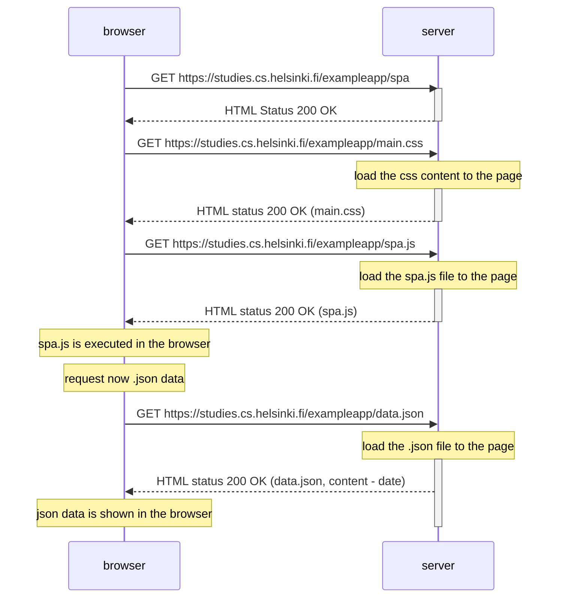

```mermaid
sequenceDiagram
    participant browser
    participant server
    
    browser->>server: GET https://studies.cs.helsinki.fi/exampleapp/spa
    activate server
    server-->>browser: HTML Status 200 OK
    deactivate server
   
    browser->>server: GET https://studies.cs.helsinki.fi/exampleapp/main.css
    Note over server: load the css content to the page
    activate server
    server-->>browser: HTML status 200 OK (main.css)
    deactivate server

    browser->>server: GET https://studies.cs.helsinki.fi/exampleapp/spa.js
    Note over server: load the spa.js file to the page
    activate server
    server-->>browser: HTML status 200 OK (spa.js)
    deactivate server    

    Note over browser: spa.js is executed in the browser
    Note over browser: request now .json data

    browser->>server: GET https://studies.cs.helsinki.fi/exampleapp/data.json
    Note over server: load the .json file to the page
    activate server
    server-->>browser: HTML status 200 OK (data.json, content - date)
    Note over browser: json data is shown in the browser

    deactivate server   
```