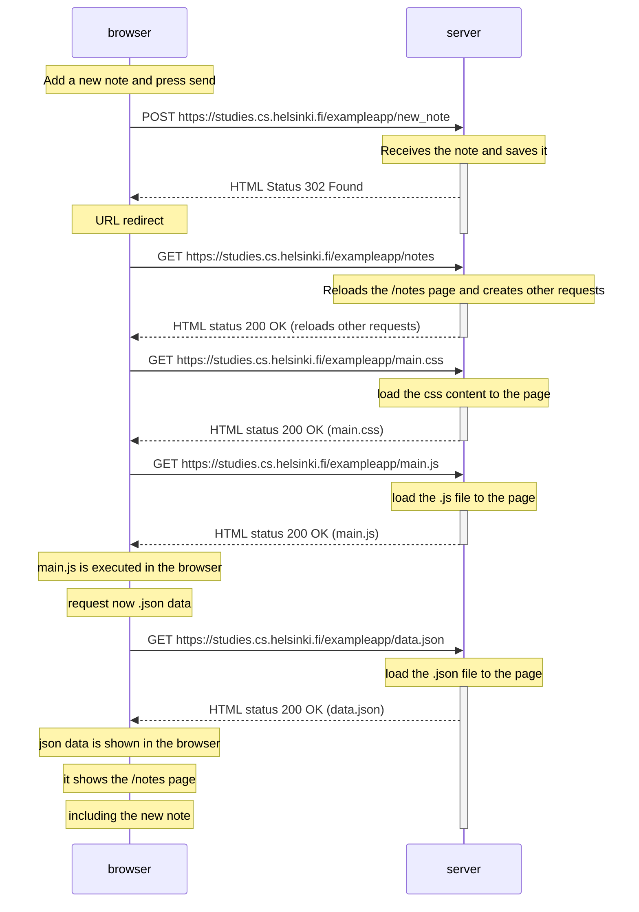

```mermaid
sequenceDiagram
    participant browser
    participant server
    
    Note over browser: Add a new note and press send
    browser->>server: POST https://studies.cs.helsinki.fi/exampleapp/new_note
    Note over server: Receives the note and saves it
    activate server
    server-->>browser: HTML Status 302 Found
    Note over browser: URL redirect
    deactivate server
    
    browser->>server: GET https://studies.cs.helsinki.fi/exampleapp/notes
    Note over server: Reloads the /notes page and creates other requests
    activate server
    server-->>browser: HTML status 200 OK (reloads other requests)
    deactivate server
    
    browser->>server: GET https://studies.cs.helsinki.fi/exampleapp/main.css
    Note over server: load the css content to the page
    activate server
    server-->>browser: HTML status 200 OK (main.css)
    deactivate server
    
    browser->>server: GET https://studies.cs.helsinki.fi/exampleapp/main.js
    Note over server: load the .js file to the page
    activate server
    server-->>browser: HTML status 200 OK (main.js)
    deactivate server    

    Note over browser: main.js is executed in the browser
    Note over browser: request now .json data

    browser->>server: GET https://studies.cs.helsinki.fi/exampleapp/data.json
    Note over server: load the .json file to the page
    activate server
    server-->>browser: HTML status 200 OK (data.json)
    Note over browser: json data is shown in the browser
    Note over browser: it shows the /notes page
    Note over browser: including the new note
    deactivate server   
```