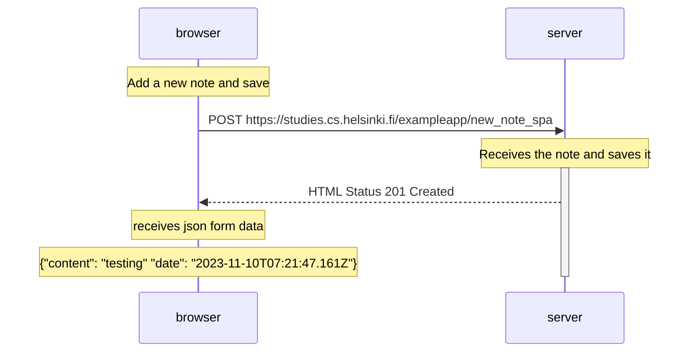

```mermaid
sequenceDiagram
    participant browser
    participant server
    
    Note over browser: Add a new note and save
    browser->>server: POST https://studies.cs.helsinki.fi/exampleapp/new_note_spa
    Note over server: Receives the note and saves it
    activate server
    server-->>browser: HTML Status 201 Created
    note over browser: receives json form data 
    Note over browser: {"content": "testing" "date": "2023-11-10T07:21:47.161Z"}
    deactivate server
   

```